# Fabrication of Outer Barrel custom piece for Airsoft M4 in Carbon Fiber


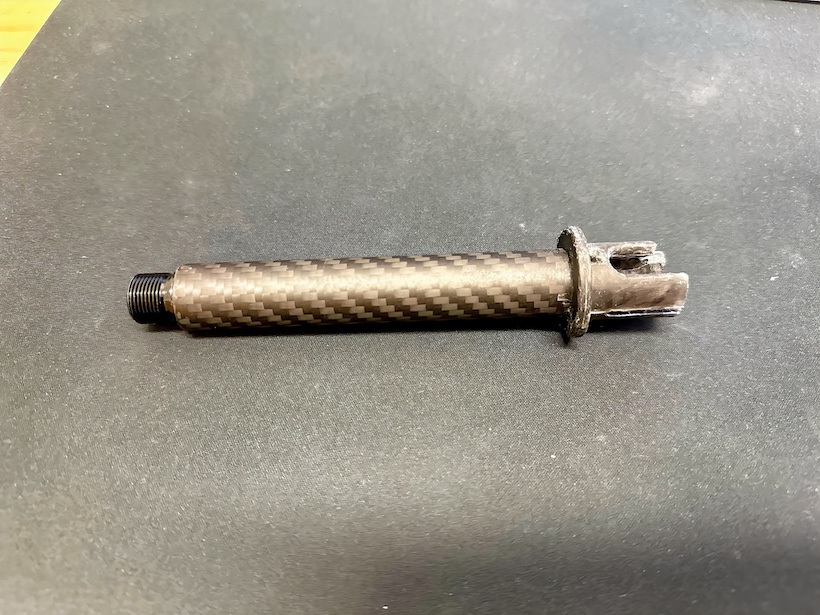
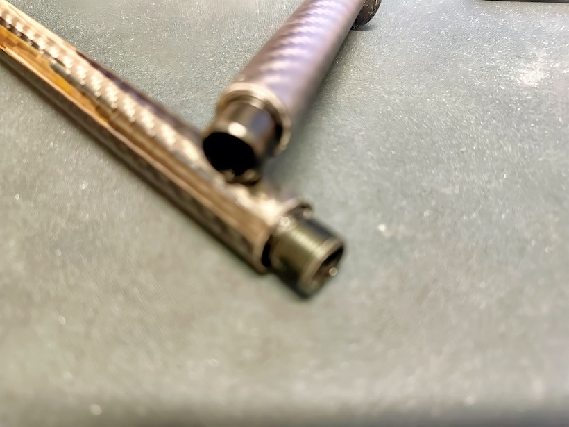


Recycling carbon presents an opportunity to achieve near-complete reutilization, where carbon scraps are meticulously trimmed and repurposed for the creation of pressed components. This gradual unveiling of processes and resulting parts showcases the remarkable potential inherent in such practices.

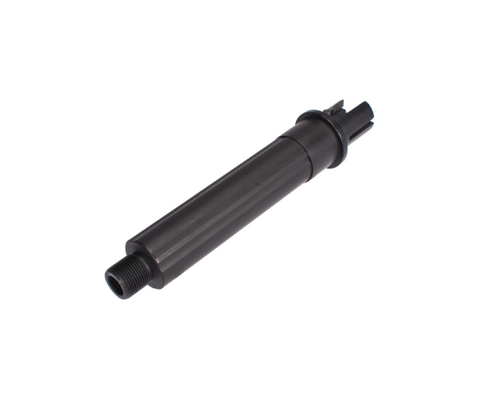

First of all, our attention is focused on the tip where the suppressor would be placed, a critical element which has a counterclockwise thread. The problem is that we cannot mill the part to make the thread. It will probably have to withstand some pressure, we will be limited by the rapid wear and tear in removing and inserting some metal element. To experiment we try to remove the thread directly with the press so we can carefully evaluate the result and durability.

Additional reinforcement will most likely be required, with the possible incorporation of miniature taper screws to reinforce the integrity of the thread.

Secondly, we get into the realm of an intricate internal component that fits snugly into the upper body of the Airsoft replica. This particular part plays a critical role in securing the tube to the ris and at the same time accommodating the insertion of the hop-up into it. The fabrication of this intricate component proves to be a formidable task, given the presence of protrusions and variable dimensions. A meticulous approach is essential to ensure the functionality and durability of this component.

And the final part is the tube, the length of the tube in question presents a certain degree of variability, which requires precise trimming adapted to our specific requirements. This adaptability gives us the freedom to customize and perfectly integrate each resulting part into the desired design.

<video src="https://www.youtube.com/shorts/rIVesrD2KYI" controls preload></video>

Piece with side view of the final product
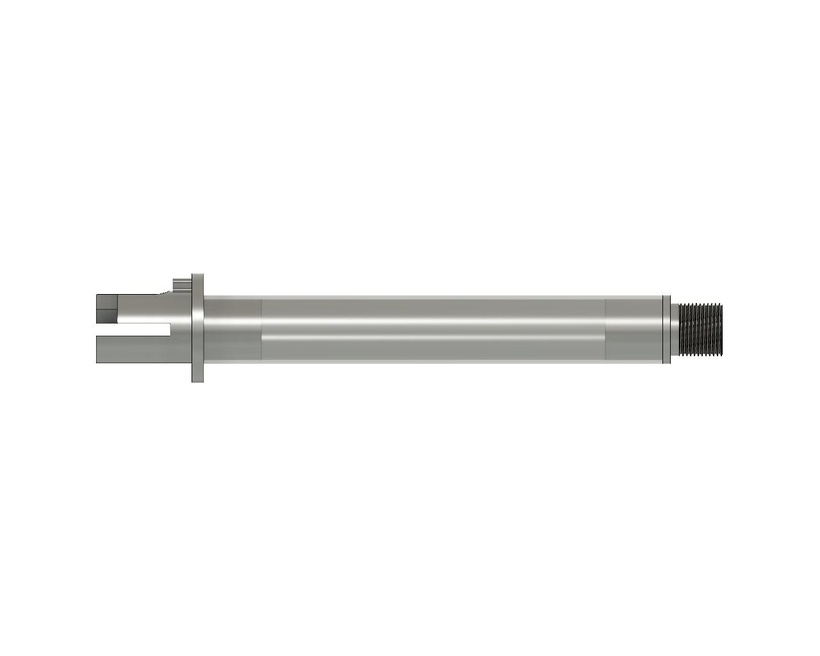

Cutting / diagram of parts and their joints
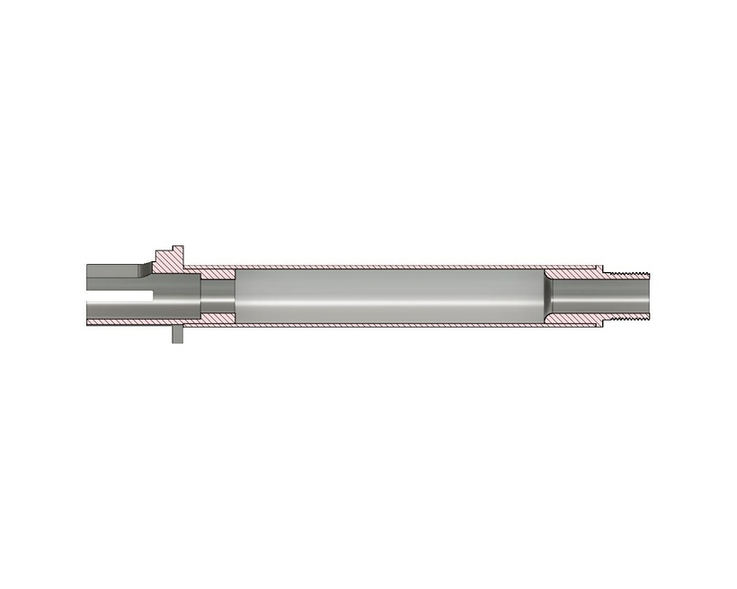

This model you can get for free on cults3D: [Cults3D Model](https://cults3d.com/:1787756)

The mold creation process: To create the tip for the suppressor, we construct a mold model with a base, cap, pin, centering pins, and a locking washer. The final shape will be cubic, ensuring precise molding.

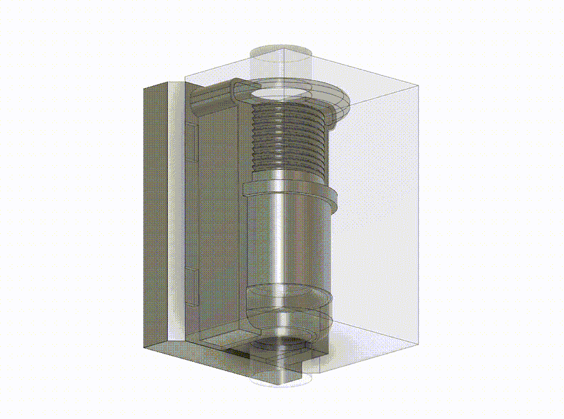

**Determining the quantity of carbon and resin:**

By analyzing the volume of the modeled part, we calculate the required amount of carbon and epoxy resin. With a recommended mix of ***60%*** carbon and **40%** resin, we round up the quantities for optimal results.

In the program after modeling the piece to mold / manufacture if we give properties you can see what volume normally should appear in cubic milliliters `(mm^3)`.

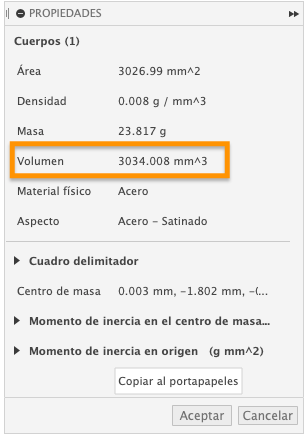

**The conversion formula is:**

```
grams = cubic milliliters × 0.001 therefore: X mm^3 / 1000  
The tip has 3034.008mm^3 / 1000 = 3.034008g (grams)
```

This is the final weight of the piece. Now we calculate the amount of carbon we will need and the resin part, we have already said that carbon is ***60%*** so we will need `~1.8204 grams` of carbon and `~1.21 grams` of resin. Normally a little more is used, we round up the quantities, taking into account that the excess resin will come out of the mold.

**The formula for calculating percent of quantity is:

```
**percent * quantity / 100
60% * 3.034g = **1.8204g**
40% * 3.034g = **1.21g**  
```

## Applying wax for smooth surfaces: 

To facilitate easy removal and achieve a smooth surface, we apply wax both inside and outside the mold. Manual wax application Inside we will use manual wax application as it will leave the surface smoother and the 3D printing layers will not show through, while a spray is used outside to remove excess resin remnants.

For now we set carbon aside and are going to use PLA+ to print our models due to its ease of printing and simple handling when polishing.

My printer is an Ender 3 Pro with Klipper, which in the future will become Voron Switch.

We set the layers to `0.15mm` with Linear Advance to achieve print quality similar to normal printing but in less time. The duration of the process is approximately 4 hours.

For the internal part, we apply the same settings and the printing takes about 8 hours.

My recommendation is to leave the printing overnight to have the parts ready the next day. I prefer to print the parts separately so that I can do measurement checks and detect possible errors.

In the design of the model, we consider a margin of ***0.20mm*** between the pieces that are joined and we also think about how the excess resin will be evacuated.

Before starting the process, we make sure to meticulously prepare the pieces to guarantee an impeccable result. To do so, we carefully sand the interior surfaces, eliminating any artifacts or defects that could affect the quality of the final product. This stage is crucial, as any imperfection will be reflected in the final finish of the project.

In addition, we conduct thorough testing to ensure that the parts assemble smoothly and seamlessly, avoiding any possible stranding that may arise during assembly. Precision in this step is essential to ensure a perfect fit between parts.

To prevent the parts from sticking to the surface during the resin and carbon process, we apply a uniform layer of wax to the contact areas (I put on the entire part). This layer acts as a barrier, facilitating later removal and preventing the parts from sticking.

The process of applying the resin and carbon is an art in itself. We use a special brush to apply the first layer of resin, making sure to cover every corner of the parts. Then, with care and precision, we place pieces of carbon cloth over the resin. This process is meticulously repeated until all the pieces are completely impregnated.

In the case of the lid, we apply a generous amount of resin and then add an even layer of carbon. Once all the parts are prepared, we assemble them and wrap them carefully with plastic wrap or cling film. To ensure a perfect bond, we use a clamp to apply pressure evenly to all areas. During this step, it is normal for a little resin to protrude, indicating that the process is being carried out effectively.

After the entire process is complete, we let the parts sit for approximately 12 hours. This waiting time is essential to allow the resin and carbon to harden not completely, thus ensuring the structural integrity of the parts, and to be able to subtract from the mold without problems. The pieces will have to cure for another 12 hours and they will be like stone shaped as we wish.

<video src="content/rendition.m3u8_1736195937051_0.mp4-hevc-q28.mp4" controls preload></video>

One of the crucial parts in making your own M4 stock is the handling of the carbon tube. Although you can buy pre-designed tubes from China, it is often necessary to customize them to your specific needs. At this stage, you will be faced with an important decision: how to cut the carbon tube efficiently and accurately?

# Choosing a Carbon Tube

First and foremost, make sure you buy the right tube for your project. As I mentioned earlier, we generally opt for pre-built tubes of `50cm` in length. In this case, we bought a tube with dimensions of `18x16x500mm` and one of `32mm` in diameter for a reasonable price of approximately `10€`, including shipping, from the following website: [Purchase Link](https://es.aliexpress.com/item/1005004139982617.html?spm=a2g0o.order_detail.order_detail_item.5.488a39d3IQXEao&gatewayAdapt=glo2esp)

# Necessary tools

Before starting the cutting process, make sure you have the right tools at hand. You can opt for a traditional saw, although you should keep in mind that carbon does not cut easily with this method. The most recommended option would be to use a rotary tool such as a Dremel. Personally, I use a **Teccpo** model that comes with an extension cord.

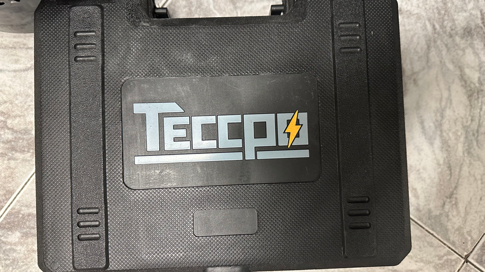

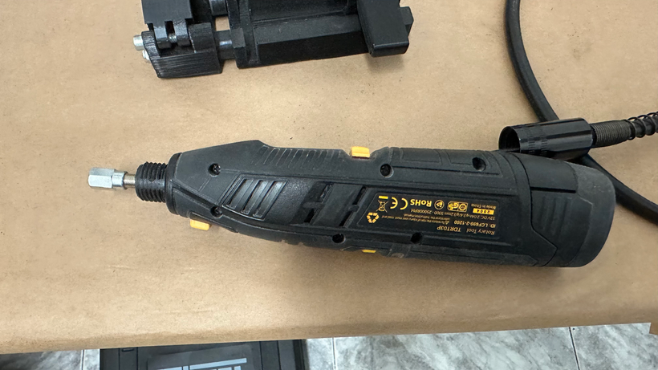

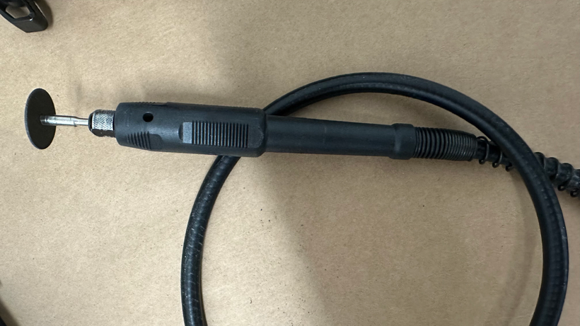

## How to cut with Dremel

To make precise, clean cuts in the carbon tube, I designed a holder that holds the tube securely and allows it to rotate for straight cuts. The Dremel's extension cable connects to the main handle, and the tube is held in place using clips. At the base of the holder, there are four wheels that make it easy to rotate the tube for precise, clean cuts.

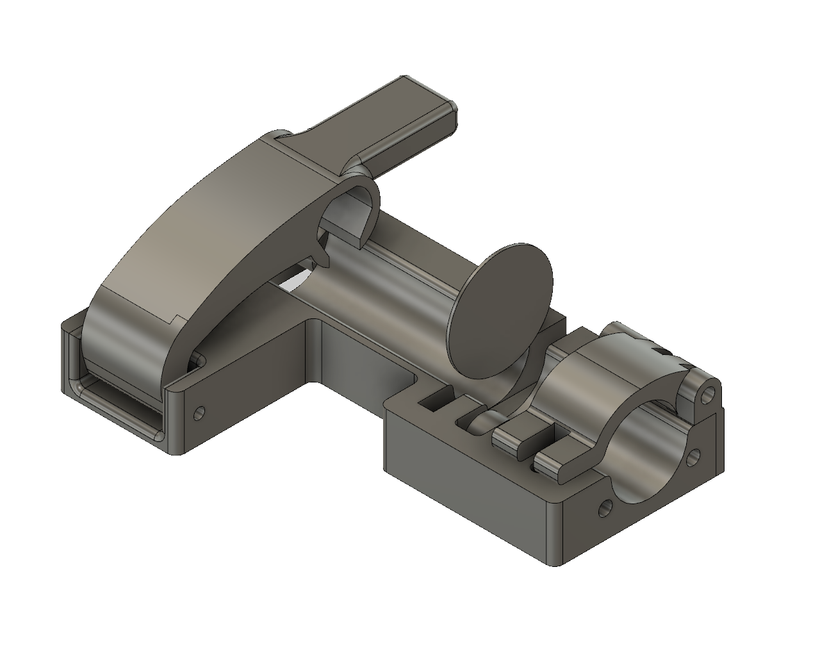

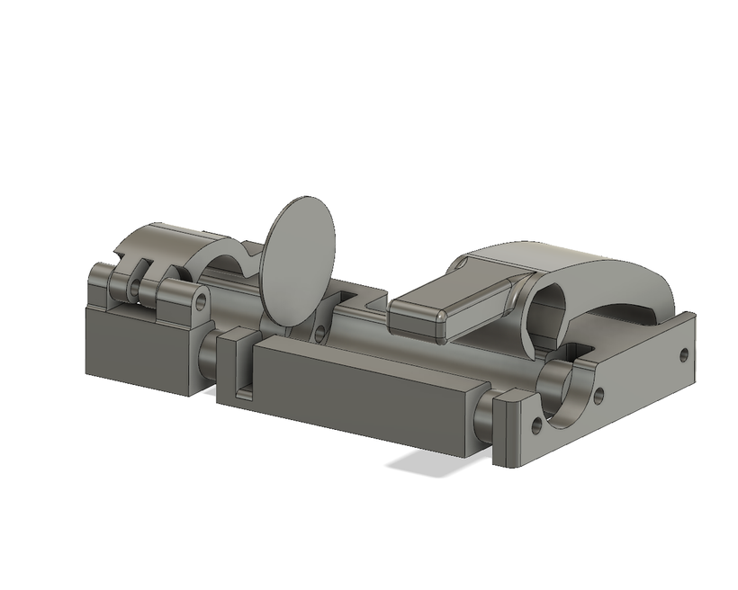

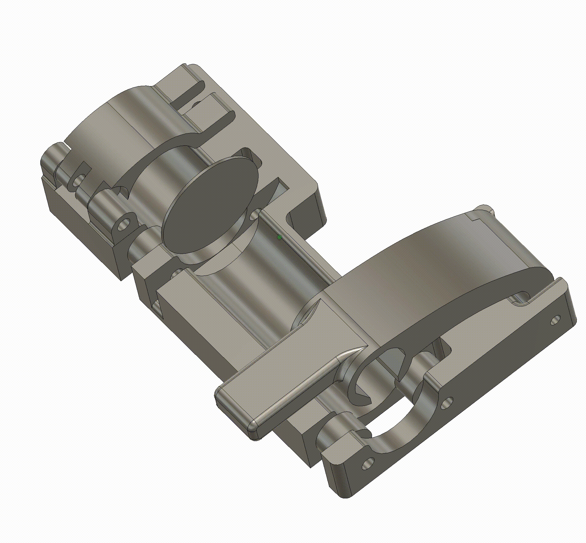

# Results

Once you have cut the tube to your specifications, be sure to check the edges to make sure they are smooth and chip-free.

In the video below, I've documented the cutting process using the Dremel and the designed holder, which will give you a clear picture of how to perform this crucial step in creating your own M4 stock.

Video of how it is cut can be seen here: 

<video src="content/rendition.m3u8-cutting.mp4" preload controls></video>

Remember, precision and safety are key at every stage of your project - good luck and happy making!  

<video src="content/1rendition.m3u8_1736196193621_0.mp4-hevc-q28.mp4" preload controls></video>


We began the sanding process using a grid type sandpaper with 80 and 240 grit to ensure a smooth and uniform finish on the parts. We chose not to increase the grade of the sandpaper, as this texture is ideal for facilitating adhesion between parts during assembly.

To protect the visible areas and avoid accidental scratches, we carefully cover the parts with special attention to detail.

As for joining the parts, we use a highly effective two-component epoxy glue. We prepare the right mixture and apply it precisely to the joints. The advantage of this glue lies in its rapid hardening process, which takes less than a minute, ensuring a solid and durable bond between the parts.

This meticulous approach to the sanding and assembly process allows us to achieve high quality results and ensure the structural integrity of each part. Each step is performed with care and precision to ensure a flawless and durable final product.

<video src="content/3rendition.m3u8_1736196251750_0.mp4" controls preload></video>

The tube support and hop-up bracket are critical and complex components in its manufacture. This is the third version of the mold, and I will soon share a more updated version in future posts. This mold is composed of four main parts and two internal parts, one of which is discarded and the other is retained for processing.

The fabrication method follows the same basic process we apply to other parts: 

first, we carefully sand the surfaces to ensure a smooth finish; then, we apply a layer of wax to facilitate mold release. Next, we join the mold pieces together. In this particular case, we fasten them together using screws. To prevent the formation of bubbles or other defects during casting, we apply plasteline to the joints. This plasteline not only prevents imperfections, but also protects the screws during the process.

This meticulous approach to manufacturing ensures that each component is of the highest quality, with no visual or structural defects. Every step, from sanding to imperfection protection, is carefully performed to achieve an exceptional final product.


---

# Costs

Assuming that we have basic tools such as dremel, drill, sandpaper, 3D printer etc...

| Material | Unit | Cost |
|--|--|--|
|[Carbon Tube](https://es.aliexpress.com/item/1005004139982617.html?spm=a2g0o.order_detail.order_detail_item.5.488a39d3IQXEao&gatewayAdapt=glo2esp)|1|9,05€ with (-20%)|
|[Aluminium Adapter 12mm CW to 14mm CCW]()| 1 | 0,92€ |
|[Right Hand Thread Tap HSS](https://es.aliexpress.com/item/4000712624358.html?spm=a2g0o.order_list.order_list_main.88.7d85194d3GhdmP&gatewayAdapt=glo2esp)|1|3,37€|
| ***TOTAL*** | 3 | ***13,34€*** |


# Models and Files

The models are for a fee and you can find them here: [Cults3D](https://cults3d.com/es/modelo-3d/juegos/diy-outer-barrel-airsoft-m4-aeg)


### FAQ

- ***Why are they paid for?***
    - _I have taken time to write this article, I have spent time printing and testing parts to give you everything ready..._